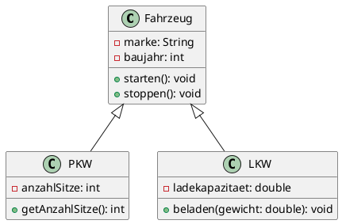
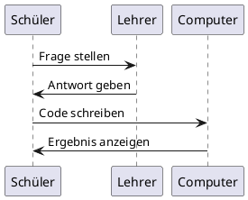

<!--
author:   Sebastian Zug, André Dietrich

email:    Sebastian.Zug@informatik.tu-freiberg.de

version:  0.1.0

language: de

narrator: Deutsch Male

mode:     Presentation

comment:  Workshop zum Einsatz von LiaScript im Schulunterricht —
          Sächsischer Schulinformatiktag 2026. Dieser Kurs ist
          gleichzeitig Präsentation und Anschauungsobjekt.

import:   https://raw.githubusercontent.com/LiaTemplates/LiveEdit-Embeddings/refs/tags/0.0.1/README.md
          https://raw.githubusercontent.com/liaTemplates/AVR8js/main/README.md
          https://raw.githubusercontent.com/LiaTemplates/plantUML/master/README.md
          https://raw.githubusercontent.com/LiaScript/CodeRunner/master/README.md

translation: Deutsch  translations/German.md

@style
.flex-container {
    display: flex;
    flex-wrap: wrap;
    align-items: stretch;
    gap: 20px;
}

.flex-child {
    flex: 1;
    margin-right: 20px;
}

@media (max-width: 600px) {
    .flex-child {
        flex: 100%;
        margin-right: 0;
    }
}
@end

-->

[](https://liascript.github.io/course/?https://raw.githubusercontent.com/LiaPlayground/Saechsischer_Schulinformatik_Tag_2026/refs/heads/main/lia_tutorial.md#1)

# WS2.03. LiaScript im Informatikunterricht

<section class="flex-container">

<!-- class="flex-child" style="min-width: 250px;" -->
> <h2>Herzlich Willkommen!</h2>
>
><h4>Online-Workshop anlässlich des Sächsischen Schulinformatiktag 2026, 18. März 2026</h4>

<!-- class="flex-child" style="min-width: 250px;" -->
 erweitert um LiaScript Logo")

</section>

--------------------------------------------

_Dieser gesamte Workshop — Präsentation, Demos, Quizze — ist ein einziges Textdokument. Den Quellcode finden Sie unter [GitHub](https://github.com/SebastianZug/Saechsischer_Schulinformatik_Tag_2026)._


## Akteure und Ziele

Wer sind wir?
=====================

+ __Prof. Dr. Sebastian Zug__ (TU Bergakademie Freiberg, Institut für Informatik)
+ __Dr. André Dietrich__
+ __Internationale LiaScript Community__ :-)

Was wollen wir heute erreichen?
====================

1. LiaScript in OPAL erleben
2. Verstehen: _"Das ist alles nur eine Textdatei"_
3. Demo: Interaktive Inhalte erstellen
4. Den Weg zum Lernenden am Beispiel von GitHub nach OPAL-Schule

> Achtung, das Ganze ist lediglich eine knappe Einführung — es gibt noch viel mehr zu entdecken! 

## Probieren Sie es aus!

> <!-- Style="color:green" -->__Sie sehen diesen Kurs gerade in OPAL. Klicken Sie sich durch die folgenden Abschnitte und probieren Sie alles selbst aus!__

https://bildungsportal.sachsen.de/opal/auth/RepositoryEntry/53657829377/CourseNode/1773805219037642010?5

### Quiz

Testen Sie Ihr Wissen — die Antworten werden direkt im Browser ausgewertet:

Welche Programmiersprache ist _keine_ objektorientierte Sprache?

- [( )] Java
- [( )] Python
- [(X)] C
- [( )] C++
***

C ist eine prozedurale Programmiersprache. Objektorientierte Konzepte wie Klassen und Vererbung wurden erst mit C++ eingeführt.

***

---

Ordnen Sie die Begriffe richtig zu:

- [[Compiler]    [Interpreter]  [Assembler]]
- [    [X]           [ ]           [ ]     ]  Übersetzt gesamten Quellcode vor der Ausführung
- [    [ ]           [X]           [ ]     ]  Führt Quellcode Zeile für Zeile aus
- [    [ ]           [ ]           [X]     ]  Übersetzt Assemblersprache in Maschinencode

### PlantUML Diagramm

> **Aufgabe:** Fügen Sie eine Klasse `Motorrad` hinzu, die von `Fahrzeug` erbt!


@plantUML.eval(png)

> **Hinweis:** Dieses Beispiel basiert auf der [PlantUML Integration](https://github.com/LiaScript/PlantUML), die die Erstellung und Ausführung von PlantUML-Diagrammen direkt im Browser ermöglicht. Der Code kann wie hier gezeigt, veränderbar sein oder unsichtbar bleiben.

### Arduino Simulation

> **Aufgabe:** Ändern Sie die Blinkfrequenz eines simulierten Arduino UNO auf 500ms!

<div>
  <wokwi-led color="red" pin="13" port="B" label="13"></wokwi-led>
  <span id="simulation-time"></span>
</div>
```cpp       arduino.cpp
// einmaliges Ausführen
void setup() {
  pinMode(13, OUTPUT);
}

// Endlosschleife
void loop() {
  digitalWrite(13, HIGH);
  delay(1000);
  digitalWrite(13, LOW);
  delay(1000);
}
```
@AVR8js.sketch

> **Hinweis:** Das Beispiel basiert auf der [AVR8js Simulation](https://github.com/LiaTemplates/AVR8js), die die Ausführung von Arduino-Sketches direkt im Browser ermöglicht. Der Code wird extern kompiliert und die CPU-Simulation läuft lokal.

### Python Beispiel

> **Aufgabe:** Erweitern Sie das Programm auf 20 Fibonacci-Zahlen!

```python
def fibonacci(n):
    """Berechnet die ersten n Fibonacci-Zahlen"""
    folge = [0, 1]
    for i in range(2, n):
        folge.append(folge[i-1] + folge[i-2])
    return folge

# Berechne die ersten 10 Fibonacci-Zahlen
ergebnis = fibonacci(10)
print("Fibonacci-Folge:", ergebnis)

# Visualisierung als einfaches Balkendiagramm
for i, zahl in enumerate(ergebnis):
    balken = "█" * (zahl + 1)
    print(f"F({i:2d}) = {zahl:4d} | {balken}")
```
@LIA.python3

> **Hinweis:** Dieses Beispiel basiert auf dem [CodeRunner Template](https://github.com/LiaScript/CodeRunner), das die Ausführung von gegenwärtig 30 Programmiersprachen ermöglicht. Der Code wird auf einem Server der TUBAF kompliert und ausgeführt bzw. interpretiert und das Ergebnis zurückgegeben. Das Repo umfasst das gesamte Image, um den CodeRunner auch lokal betreiben zu können.

## Blick hinter die Kulissen

> **Alles was Sie gerade erlebt haben — Quizze, Diagramme, Arduino-Simulation, Python-Code — ist in dieser einen LiaScript-Datei beschrieben. Was steckt dahinter?**

                        {{0-1}}
*******************************************************

> __Konzept 1: Wir trennen Darstellung und Inhalt!__

Alle Elemente werden durch eine rein textuelle Repräsentation ausgedrückt. Kein spezielles Tool, kein Export — nur Text.

```markdown @embed.style(height: 550px; min-width: 100%; border: 1px black solid)
# Vom Text zur Darstellung

__Formatierung__

Das ist **fett** und das ist _kursiv_.

__Mathematik__

$f(x) = x^2 + 2x + 1$

__Tabellen__

| Sprache | Typ          | Erscheinungsjahr |
|---------|:------------:|:----------------:|
| Python  | Interpretiert|      1991        |
| Java    | Kompiliert   |      1995        |
| Scratch | Visuell      |      2007        |

```

*******************************************************

                        {{1-2}}
*******************************************************

> __Konzept 2: Digitale Lehre lebt von Interaktion!__

Tabellen werden automatisch zu Diagrammen, Quizze sind eingebaut — ohne Plugin, ohne Server.

```markdown @embed.style(height: 550px; min-width: 100%; border: 1px black solid)
# Interaktion eingebaut

__Tabelle als Diagramm__

| Sprache | Beliebtheit |
|---------|:-----------:|
| Python  |     85      |
| Java    |     65      |
| C++     |     45      |
| Scratch |     30      |

__Quiz__

Was bedeutet OOP?

- [( )] Open Online Programming
- [(X)] Objektorientierte Programmierung
- [( )] Optimal Output Processing

```

*******************************************************

                        {{2-3}}
*******************************************************

> __Konzept 3: Der Browser kann viel mehr als Webseiten anzeigen!__

Text-to-Speech, Musik, Simulationen, Code-Ausführung — alles läuft lokal im Browser.

````markdown @embed.style(height: 550px; min-width: 100%; border: 1px black solid)
<!--
import: https://raw.githubusercontent.com/liaTemplates/ABCjs/main/README.md
-->

# Browserfeatures

__Sprache__

> {{|> Deutsch Female}}
> Hallo liebe LiaScript Interessierte!

__Musik (Glück Auf!)__

``` abc
X:353
T: GLUECK AUF DER STEIGER KOEMMT
M: 4/4
L: 1/16
K: G
| G8F4A4 | G8z8 | B8A4c4 | B8z4G2A2 | B4B4B4A2B2 | c4A3AA4
A2B2 | c4c4c4B2c2 | d4B3BB4A4 | G8F8 | G4e4d4c2A2 | B8A8 | G8z8
```
@ABCJS.eval
````

*******************************************************

                        {{3-4}}
*******************************************************

> __Konzept 4: Ein Dokument — überall einsetzbar!__

<!--
style="width: 100%; max-width: 860px; display: block; margin-left: auto; margin-right: auto;"
-->
```ascii
+------------------+
| # Digital Systems|\                                      .-----------.
| (SoSe 2021)      +-+                              ╔══════|   Nativ   |══════╗
|                    |  --------------------------> ║      '-----------'      ║
| Task 1             |                              ║ Digital Systems 2021    ║
|                    |                              ║                         ║
| + Implement ...    | --------------+              ║ import numpy as np      ║
|                    |    Trans-     |              ║ ...                     ║
|                    |    formation  |              ╚═════════════════════════╝
+--------------------+               v
                                .-,(   ),-.                .-----------.
Lizenz: ...                  .-(           )-.      ╔══════|   LMS  Y  |══════╗
Inhalt: ...                 (    Exporter     )     ║      '-----------'      ║
Autor: ...                   '-(           )-'  +-->║ Digital Systems 2021    ║
Versionshistorie: ...           '-.(   ).-'     |   ║                         ║
                                     |          |
                                     +----------+          .-----------.
                                                |   ╔══════|  Webapp   |══════╗
                                                |   ║      '-----------'      ║
                                                +-->║ Digital Systems 2021    ║
                                                    ║                         ║                                     .
```

> Seit Juli 2025 können LiaScript-Kurse direkt in OPAL importiert werden. Dies wurde durch eine Kooperation der TU Bergakademie und der TU Chemnitz sowie der BPS GmbH ermöglicht. [Blogbeitrag](https://blog.hrz.tu-chemnitz.de/urzcommunity/2025/07/08/neu-im-opal-mit-liascript-schnell-zum-anschaulichen-interaktiven-kurs/)

*******************************************************


## Warum LiaScript? — Der OER-Gedanke

> __Open Educational Resources (OER)__ beschreibt die gemeinsame Entwicklung, Nutzung und Verbreitung von Lehr- und Lernmaterialien unter offener Lizenz.

                        {{0-1}}
*******************************************************

| Anforderung    | Bedeutung                                  |                              LiaScript                               |
| -------------- | ------------------------------------------ | :------------------------------------------------------------------: |
| `verwahren`    | Download, Speicherung und Vervielfältigung |         ressourceneffizient und ohne Softwarevoraussetzungen         |
| `verwenden`    | Nutzung im Lernkontext                     | native Nutzung im Browser oder eingebettet im Lern-Management-System |
| `verarbeiten`  | Umgestaltung und Adaption                  |    Bearbeitung des Textdokumentes entsprechend den Lizenzvorgaben    |
| `vermischen`   | Kombination und Extraktion                 |                  Kopieroperationen von Textinhalten                  |
| `verbreiten`   | (digitale) Publikation                     |                    im Webspace oder als Download                     |
| `VERSIONIEREN` | (digitale) Publikation                     |                            z.B. über Git                             |

*_5 V-Freiheiten für Offenheit_ nach Jöran Muuß-Merholz und Jörg Lohrer*

*******************************************************

                        {{1-2}}
*******************************************************

```ascii

      Wunsch nach                                             Wunsch nach
  einfacher Umsetzung  -----------> Konflikt <----------- spezifischen Elementen
                                       |                       im Material
                                       |
                                       v
                              OER als Lösungsansatz
                                       |
                                       v
                          LiaScript: Text + Interaktion
                                                                                    .
```

> LiaScript löst diesen Konflikt: Einfacher Text als Grundlage, aber mit voller Interaktivität.

*******************************************************

## Live Demo

> Sie können mitarbeiten, in dem Sie den Live-Editor öffnen und gemeinsam mit mir am Code arbeiten.

https://liascript.github.io/LiveEditor/


### Schritt 1: Markdown Grundlagen

Starten Sie mit diesem Grundgerüst im LiveEditor:

```text
Mein erster LiaScript-Kurs

Das ist ein Absatz mit Formatierung.

Kapitel 1: Tabellen

| Schüler  | Note |
|----------|:----:|
| Anna     |  1   |
| Ben      |  2   |
| Clara    |  1   |

Kapitel 2: Formeln

Die Fläche eines Kreises: $A = \pi r^2$
```

### Schritt 2: Quiz hinzufügen

Ergänzen Sie ein Quiz in Ihrem Kurs:

```text
## Quiz

Welche Programmiersprache ist _keine_ objektorientierte Sprache?

- [( )] Java
- [( )] Python
- [(X)] C
- [( )] C++

C ist eine prozedurale Programmiersprache. Objektorientierte Konzepte wie 
Klassen und Vererbung wurden erst mit C++ eingeführt.
```

### Schritt 3: Ausführbarer Code

```cpp
int main() {
    std::cout << "Hallo, Welt!" << std::endl;
    return 0;
}
```

Im Browser kann js-Code unmittelbar ausgeführt werden.

``` javascript
console.log("Hallo, Welt!");    
```
<script>@input</script>

Für andere Programmiersprachen wird der Code an einen Server geschickt, dort ausgeführt und das Ergebnis zurückgegeben. Dafür existieren verschiedene Templates (AVR8js für Arduino, CodeRunner für 30+ Sprachen, PyOdide für Python, ...)

https://github.com/LiaScript/CodeRunner

````text
<!--
import: https://raw.githubusercontent.com/LiaScript/CodeRunner/master/README.md
-->

## Python

```python
name = "Schulinformatiktag"
for i in range(5):
    print(f"{i+1}. Willkommen beim {name}!")
```
@LIA.python3
````

> Sie können natürlich auch deutlich komplexere Programme mit mehreren Dateien, Abhängigkeiten usw. erstellen.

### Schritt 4: PlantUML Diagramm

Fügen Sie ein editierbares Diagramm ein. Dafür nutzen wir das LiaScript Template für PlantUML.

https://github.com/LiaTemplates/plantUML

Dabei gibt es zwei Möglichkeiten:

+ Das Diagramm wird direkt im Kurs angezeigt (`@plantUML.png` als Makroparameter)
+ Das Diagramm wird als editierbarer Codeblock angezeigt, der mit einem Button ausgeführt werden kann (`@plantUML.eval(png)` als Ausführungsanweisung)

```text
<!--
import: https://raw.githubusercontent.com/LiaTemplates/plantUML/master/README.md
-->
```

```
## UML Diagramm


```

## Verbreitung 

> Wie kommt Ihr LiaScript-Kurs von einer Textdatei in Ihr Lernmanagementsystem?

Letztendlich ist es egal, wo Ihre `.md`-Datei liegt — solange sie über eine URL erreichbar ist. Es gibt viele Möglichkeiten, dies zu erreichen.

### Variante 1: Repository auf GitHub

<!--
style="width: 100%; max-width: 860px; display: block; margin-left: auto; margin-right: auto;"
-->
```ascii

 Lokaler Computer                          GitHub
+---------------------+                  +-------------------------+
|                     |     git push     |                         |
|  lia_tutorial.md    | ---------------> |  Repository             |
|  images/            |                  |  lia_tutorial.md        |
|                     |                  |  images/                |
+---------------------+                  +-------------------------+
                                                    |
                                                    | Raw-URL
                                                    v
                                          https://raw.github...
                                          .../lia_tutorial.md
                                                                                                              .
```

1. Erstellen Sie ein Repository auf GitHub
2. Laden Sie Ihre `.md`-Datei hoch
3. Die Raw-URL ist Ihr Kurs-Link

Kombinieren Sie die LiaScript-URL mit Ihrer Raw-URL:

`https://liascript.github.io/course/?IHRE_RAW_URL`

> Genau so sehen Sie diesen Workshop gerade — als LiaScript-Kurs, gerendert aus einer Markdown-Datei auf GitHub.

### Variante 2: Import in OPAL

> Seit Juli 2025 unterstützt OPAL den direkten Import von LiaScript-Kursen. Sie benötigen nur die GitHub-URL Ihrer Markdown-Datei. [Anleitung](https://blog.hrz.tu-chemnitz.de/urzcommunity/2025/07/08/neu-im-opal-mit-liascript-schnell-zum-anschaulichen-interaktiven-kurs/)

<!--
style="width: 100%; max-width: 860px; display: block; margin-left: auto; margin-right: auto;"
-->
```ascii

  GitHub                        OPAL
+------------------+          +----------------------------+
|                  |          |                            |
| lia_tutorial.md  |  zip     | Kurs anlegen               |
|                  | -------> | > Lernressource hinzufügen |
+------------------+          | > LiaScript auswählen      |
       |                      | > Zip Datei referenzieren  |
       |                      |                            |
       v                      +----------------------------+
  Raw-URL kopieren                       |
                                         v
                              Fertiger interaktiver Kurs!
                                                                                                              .
```


## Zusammenfassung

Was haben wir heute gesehen?
============================

{{0-1}}
| Thema                | Erkenntnis                                            |
| -------------------- | ----------------------------------------------------- |
| __Interaktivität__   | Quizze, Diagramme, Code-Ausführung — alles im Browser |
| __Einfachheit__      | Nur Text — kein spezielles Tool nötig                 |
| __OER-tauglich__     | Versionierung, Zusammenarbeit, offene Lizenz          |
| __OPAL-Integration__ | Direkter Import von GitHub nach OPAL                  |

{{1}}
*******************************************************

> __Dieser gesamte Workshop war ein einziges Textdokument.__
>
> Den Quellcode zu diesem Kurs finden Sie auf [GitHub](https://github.com/SebastianZug/Saechsischer_Schulinformatik_Tag_2026).

Weiterführende Links:

- [LiaScript Projektwebseite](https://liascript.github.io/)
- [LiaScript Dokumentation](https://liascript.github.io/course/?https://raw.githubusercontent.com/liaScript/docs/master/README.md#1)
- [YouTube-Channel](https://www.youtube.com/channel/UCyiTe2GkW_u05HSdvUblGYg)
- [LiveEditor](https://liascript.github.io/LiveEditor/)
- [OPAL-LiaScript Blogbeitrag](https://blog.hrz.tu-chemnitz.de/urzcommunity/2025/07/08/neu-im-opal-mit-liascript-schnell-zum-anschaulichen-interaktiven-kurs/) vergleichbares vorgehen in OPAL-Schule

*******************************************************
